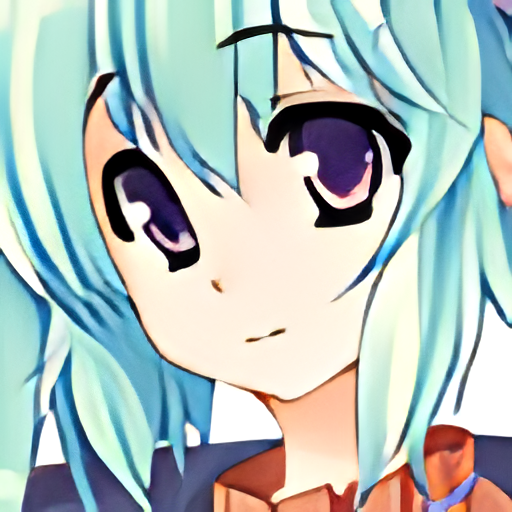

# Real-ESRGAN
PyTorch implementation of a Real-ESRGAN model trained on custom dataset. This model shows better results on faces compared to the original version. It is also easier to integrate this model into your projects.

Real-ESRGAN is an upgraded [ESRGAN](https://arxiv.org/abs/1809.00219) trained with pure synthetic data is capable of enhancing details while removing annoying artifacts for common real-world images.

You can try it in [google colab](https://colab.research.google.com/drive/1YlWt--P9w25JUs8bHBOuf8GcMkx-hocP?usp=sharing) [](https://colab.research.google.com/drive/1YlWt--P9w25JUs8bHBOuf8GcMkx-hocP?usp=sharing)

- Paper: [Real-ESRGAN: Training Real-World Blind Super-Resolution with Pure Synthetic Data](https://arxiv.org/abs/2107.10833)
- [Official github](https://github.com/xinntao/Real-ESRGAN)

### Installation

---

1. Clone repo

   ```bash
   git clone https://github.com/MaximDrobchak/Resize-Images-ESRGAN-pytorch
   cd Real-ESRGAN
   ```

2. Install requirements

   ```bash
   pip install -r requirements.txt
   ```

3. Start
  ```bash
   python main.py
   ```
### Usage

---

Basic usage:

```python
import torch
from PIL import Image
import numpy as np
from realesrgan import RealESRGAN

device = torch.device('cuda' if torch.cuda.is_available() else 'cpu')

model = RealESRGAN(device, scale=4)
model.load_weights('weights/RealESRGAN_x4.pth')

path_to_image = 'inputs/test.png'
image = Image.open(path_to_image).convert('RGB')

sr_image = model.predict(image)

sr_image.save('results/test.png')
```

### Examples

---

Low quality image:


Real-ESRGAN result:

